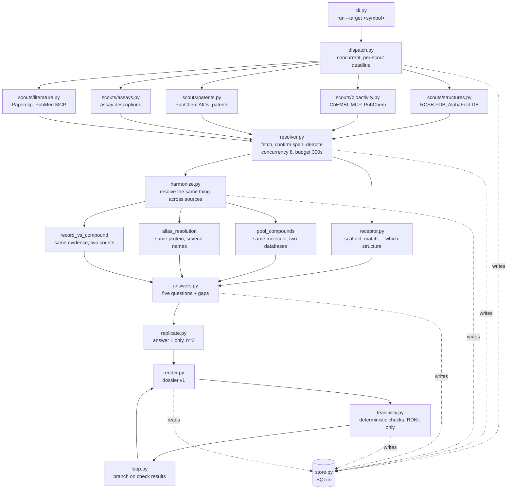
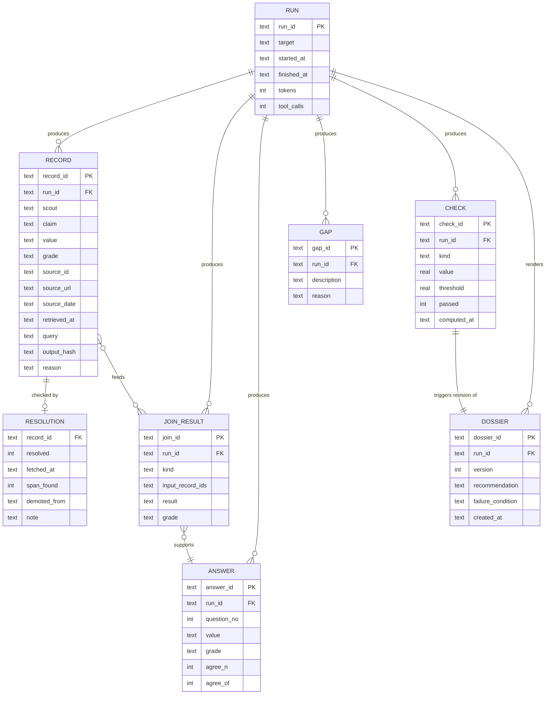
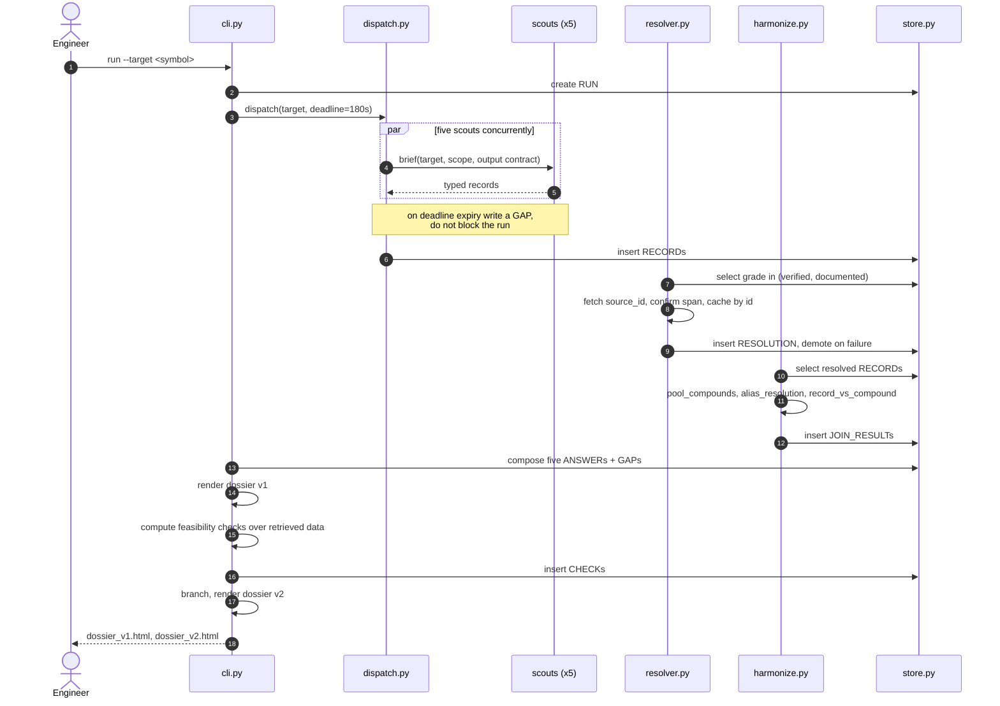
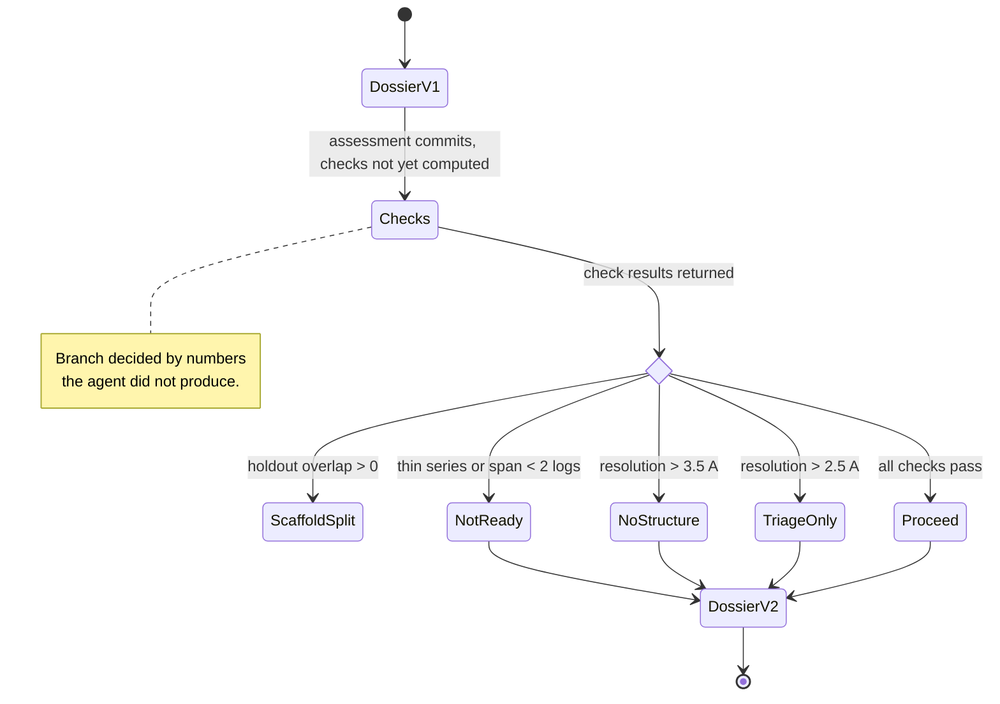

# Architecture — target dossier agent

Diagrams and data model. Build sequence lives in [`PLAN.md`](PLAN.md); contracts and
thresholds in [`SPEC.md`](SPEC.md); the reasoning behind both in [`DESIGN.md`](DESIGN.md).

## 1. System flow



Every stage writes to the store and reads from it. No stage passes objects directly to the
next, so any stage can be re-run alone against a previous run's data.

`structures` and `bioactivity` are **required**; the other three are **contributing**. If a
required scout gaps, the verdict is `insufficient retrieval` and the feasibility checks are
skipped rather than computed over absent data.

## 2. Data model



Three grade rules are enforced as `CHECK` constraints rather than in prose, so a violation
fails at insert time next to the code that caused it:

```sql
CHECK (grade NOT IN ('verified','documented') OR source_url IS NOT NULL)
CHECK (grade <> 'measured'   OR output_hash IS NOT NULL)
CHECK (grade <> 'unverified' OR reason      IS NOT NULL)
```

## 3. One run, end to end



## 4. The loop



Data splitting is deliberately absent: whether a future model could be validated
says nothing about whether this protein is tractable. See `DESIGN.md` D8.

"Thin series" is `n_analogs < 20`, `n_distinct_inchikeys != n_analogs`, or
`dominant_scaffold_n < 15`. Scaffold *count* is not a criterion — a congeneric series
correctly collapses to one Murcko scaffold, and gating on diversity would reject the very
property the dossier is looking for. See `DESIGN.md` D1.

## 5. Repository layout

```
pgrn-lead-optimization/
├── dossier/
│   ├── __init__.py
│   ├── cli.py            # entrypoint
│   ├── store.py          # schema + typed insert/select
│   ├── dispatch.py       # concurrent scouts, deadlines, required-scout rule
│   ├── grades.py         # Grade enum, demotion rules
│   ├── resolver.py       # citation gate, budget, cache
│   ├── harmonize.py      # resolve the same thing across sources
│   ├── receptor.py       # which structure to design against
│   ├── answers.py        # five questions + gap list
│   ├── replicate.py      # agreement on answer 1
│   ├── feasibility.py    # deterministic checks, RDKit only
│   ├── loop.py           # branch on check results
│   ├── render.py         # dossier HTML
│   └── scouts/
│       ├── base.py       # Scout protocol, brief template
│       ├── structures.py
│       ├── bioactivity.py
│       ├── patents.py
│       ├── assays.py
│       └── literature.py
├── tests/
│   ├── fixtures/sort1.py # expected values — never imported by dossier/
│   └── test_branches.py  # seven-case table over next_step
└── docs/
```

No module under `dossier/` may contain a PDB ID, ChEMBL accession, PubChem AID, compound
name or target symbol. Enforced by the Stage 6 audit:

```bash
grep -rE '6X48|5MRI|UP4|CHEMBL3091|CHEMBL4680051|2202264|norleucine|SORT1|CTSL' dossier/
```
