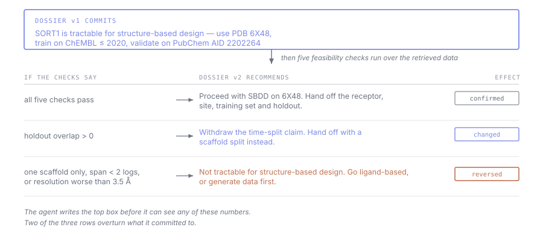
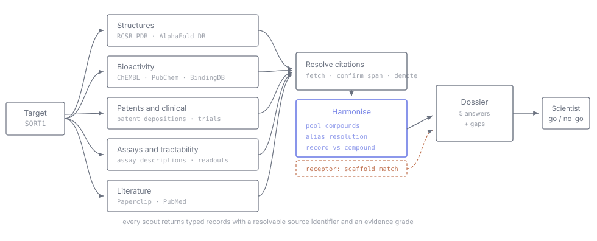
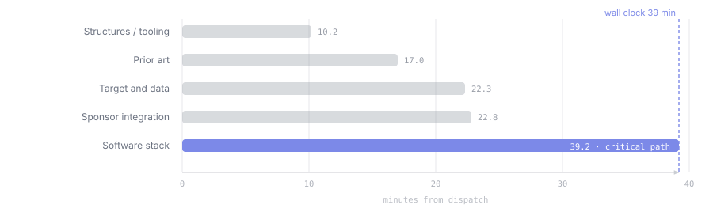
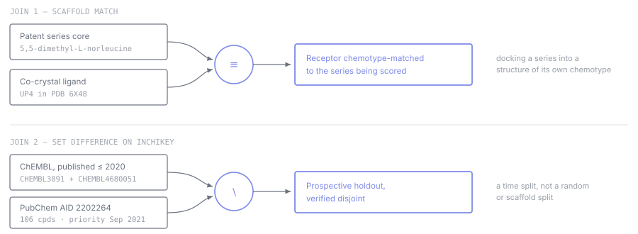
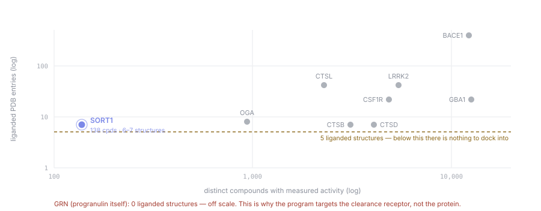

# Roadmap — target dossier agent

Input: a protein target. Output: a graded answer to **whether this target is tractable
for structure-based small-molecule drug design** — with the receptor, the training set
and the validation set already chosen, or a stated reason not to proceed.

The agent runs no structure-based calculation of any kind — no docking, no free-energy
methods, no molecular dynamics. It assesses tractability from public structural and
bioactivity data and hands a specification to whoever has the compute.

re:AGENT, Track A. Submission 10:45 AM Sun 16 Aug 2026; demos 12:30–14:00.

## 1. The question

Five questions, then stop:

1. **Is there a pocket, and which structure do we design against?** One recommended
   receptor, its resolution and method, the ligand that defines the site, and why that
   entry over the alternatives.
2. **What chemical matter exists, and how good is it?** Distinct compounds with
   measured activity, potency range, assay types.
3. **Is there a congeneric series?** A related set supporting SAR reasoning, not
   scattered singletons.
4. **What can serve as a held-out validation set?** Ideally separated by time.
5. **What is missing?** A list, with the observation that would change the answer.

The pipeline is **fixed, not planned per question**. Same five scouts, same sources,
target is the only variable.

> Robin (Ghareeb et al., *Nature* 655, 497–505) built an agentic orchestrator for this
> class of task, measured it, and removed it: *"we observed that Robin almost always
> called tools in the same order, leading to a deterministic workflow. Therefore, we
> translated Robin into a streamlined Jupyter notebook to improve stability and ease of
> use."* When the question is well-typed the planner converges on one sequence anyway.
> Hard-code it and spend the budget on verification.

### Where the value is

Any single query returns a list. The value is in the **joins between sources** — facts
no individual scout produces. Two such joins decided the whole downstream plan for
sortilin (section 4).

## 2. Closing the loop

A dossier that only recommends is a report. The loop is what makes it an agent: the
dossier commits to an assessment, then names checks it has not yet computed. The checks
run over the retrieved data, and the result rewrites the recommendation.

*Read it top to bottom. The agent writes the boxed commitment first, before it can see any of the numbers. The five checks then run, and two of the three possible outcomes overturn what it committed to — one narrows the validation claim, the other reverses the recommendation entirely. The right-hand column names the effect so the change is legible without re-reading the top box.*

**Data splitting is deliberately absent.** Whether a future model could be cleanly
validated is a planning detail for whoever picks the work up; it says nothing about
whether this protein is tractable, and partitioning the molecules makes the target look
thinner than it is. All sources are pooled on canonical identity instead. See
`DESIGN.md` D8.

**Why these checks and not a structure-based calculation.** Docking, free-energy methods
and molecular dynamics are all out of scope — no GPU budget. But the loop does not need
them. It needs a measurement the agent has not already seen, and the feasibility checks
are exactly that: the assessment commits first, the numbers are computed second, and they
can contradict it. All five run in RDKit on a laptop in seconds.

| Check | Computed from | Flips the recommendation when |
|---|---|---|
| Series size and scaffold diversity | Murcko scaffolds over the retrieved series | One scaffold, or fewer than ~20 analogs — SAR reasoning is unsupportable |
| Activity range | max/min pActivity in the series | Span < 2 log units — nothing to rank |
| Receptor ligand quality | MW and heavy-atom count of the bound ligand | Below drug-like — the pocket is defined by a fragment or an additive |
| Field activity | Date of the most recent measurement | Reported only — never changes the recommendation |
| Structure resolution | Resolution and method of the recommended entry | Worse than 2.5 Å — usable for triage and shape work, not for structure-guided optimisation |

To show the loop responds to evidence rather than to prompting, run it twice: once on
sortilin, once on a target that fails a check. **If the recommendation does not change
between them, the loop is decorative and should be reported as such.**

## 3. The pipeline

*The decomposition is fixed, not planned. The same five scouts run against the same sources for any target, so the only variable is the input. Each returns typed records rather than prose, which is what allows the join stage to operate on them mechanically instead of by re-reading summaries. Nothing reaches the join stage until its citation has been fetched and checked — see section 5.*

*Measured from the reference run. All five scouts were dispatched in one message and ran concurrently, so 131 minutes of agent work finished in the 39 minutes taken by the slowest. Total cost was 1,086,955 tokens across 436 tool calls — the figure the dossier's own cost line will report.*

| Scout | Returns | Named check it must perform |
| --- | --- | --- |
| Structures | PDB entries with resolution, method, bound ligand HET codes | Count entries with a genuinely drug-like ligand separately from total entries. For sortilin that is 6–7, not the raw count |
| Bioactivity | Distinct compounds, potency range and median, assay types | **Distinct compounds, not activity records.** These differ by an order of magnitude; conflating them is the most common error in this task |
| Patents/clinical | Series with priority dates, applicant, potency, clinical stage | Patent-derived sets are often in PubChem but absent from ChEMBL. Check both |
| Assays | Readouts available; what a computational score proxies | Flag qHTS. A target can show tens of thousands of compounds where only a few hundred carry a real IC50 |
| Literature | Mechanism, disease link, clinical outcomes including failures | Search phenotypic and pathway aliases, not only the direct target — a published series on this pathway was filed under a non-molecular target ID and is invisible to target-centric queries |

## 4. Harmonisation

*Five databases describe overlapping reality in incompatible ways. Before any count means anything, three kinds of sameness have to be resolved.*

Nothing here looks for a difference between sources. Every source contributes;
harmonisation is what stops the same fact being counted twice or missed entirely.

| Sameness | Operation | Without it |
| --- | --- | --- |
| Same molecule | `pool_compounds` on InChIKey | one molecule in two databases counts twice, and the target looks richer than it is |
| Same protein | `alias_resolution` | work filed under a pathway or disease name never appears |
| Same evidence | `record_vs_compound` | one molecule measured five times reads as five molecules |

**Receptor selection is separate**, in `dossier/receptor.py`. `scaffold_match` links two
*different* things — a patent series' core and a structure's bound ligand — to infer
which structure to design against. That is an inference, not resolving sameness, and a
chemotype match can outweigh a sharper picture of an unrelated site.

## 5. Grading and the resolver gate

| Grade | Definition | Example |
| --- | --- | --- |
| Measured | The scout executed a query or tool and recorded the result | Live ChEMBL API: 266 activities for CHEMBL3091, 37 for CHEMBL4680051 |
| Verified | Read directly in a primary record | PDB 6X48 contains ligand UP4; AID 2202264 lists 106 cpds, IC50 75 nM – 10 µM |
| Documented | Stated by an authoritative primary document | Patent US20250268854A1, Vesper Bio, priority 3 Sep 2021 |
| Inferred | Reasoned from evidence, not directly observed | Scaffold equivalence pending an explicit substructure match |
| Unverified | Could not be established; reported as absent | No deposited NCATS or Broad progranulin screen found in PubChem |

### The resolver gate

A scout that fabricated a source will confidently grade its own claim *Verified*.
Self-reported grades are worth what the retrieval layer beneath them is worth.

Measured cost of not having one: in the Robin ablation, a scientist blinded to source
attempted to locate every reference in ten proposals and found **44.5 ± 6.37% of
references from a raw frontier-model call were hallucinated**, ~58% for drug-candidate
proposals. Substituting a grounded retrieval agent brought fabricated references to zero.

**The gate:** every Verified or Documented claim carries a resolvable identifier — PDB
or ChEMBL accession, PubChem AID, DOI, patent number, or a command. An independent
resolver fetches it and confirms the quoted value is present. Failures auto-demote to
Inferred and are flagged. The scout does not get the last word on its own reliability.

### No model-judged ranking

A published chemistry evaluation ran an LLM judge and human experts over the same
outputs; the rankings inverted, the judge preferring fluent but incorrect answers. Of
the three reference systems: ERA uses no judge at all; Co-Scientist concedes in its own
figure caption that its Elo metric "is auto-evaluated and not based on independent
ground truth"; Robin calibrates a pairwise judge against experts and shows only that it
separates grossly grounded from ungrounded proposals, not that it orders by correctness.

Findings are ordered deterministically: by evidence grade, then by whether the claim is
load-bearing for the recommendation. Cost: the dossier cannot say "read this first" on
any other basis.

### Beyond the reference systems

None of the three papers reports what its system *could not* establish. Co-Scientist
names the gap as its leading future direction — "agents with enhanced provenance
capabilities to trace claims to specific figures or data within a source" — and
separately concedes a "systemic lack of access to negative experimental results". A
required, always-rendered gap list is the cheapest part of this build and has no prior art.

## 6. Worked output — the sortilin dossier

| Question | Answer | Grade |
| --- | --- | --- |
| Which receptor? | PDB 6X48, 2.9 Å, chosen over the higher-resolution 5MRI (2.00 Å) because ligand UP4 shares the core of the series. **2.9 Å is marginal for structure-guided optimisation** — adequate for triage and shape work, not for modelling individual contacts. Both are handed off | Verified |
| Chemical matter? | 266 activities in CHEMBL3091, 37 in CHEMBL4680051. IC50 88 nM – 158 µM, median 1.4 µM. Six MST-derived Kd near 1 nM are outliers, excluded | Measured |
| Congeneric series? | Yes — 106 cpds on a 5,5-dimethyl-L-norleucine core, 77 sub-µM, one patent family | Verified |
| Held-out set? | PubChem AID 2202264, priority Sep 2021, absent from ChEMBL. Time split, pending InChIKey disjointness | Inferred |
| What is missing? | Disjointness unconfirmed; no deposited progranulin HTS found; no docking has been run by anyone here, so tractability is assessed from structure and data, not demonstrated; latozinemab raised progranulin and missed its Phase 3 endpoint Oct 2025 | Unverified |

**Recommendation: sortilin is tractable for structure-based design. Proceed on 6X48,
with a resolution caveat.** The target clears the bar that kills most such projects — a
pocket with drug-like ligands bound, a congeneric series spanning two logs of potency, and
a validation set separated by time. At 2.9 Å it supports triage and shape-based work;
contact-level optimisation needs either 5MRI, which is not chemotype-matched, or a new
structure.

**Hand-off specification:** receptor 6X48, box defined from the co-crystallized UP4
ligand; training set ChEMBL SORT1 published ≤2020; prospective validation on PubChem
AID 2202264; fall back to 5MRI at 2.00 Å if pose quality on 6X48 proves inadequate.

**Failure condition:** if InChIKey disjointness fails, the prospective validation claim is
withdrawn and the hand-off specifies a scaffold split instead. If the series collapses to
a single Murcko scaffold or spans under two log units of activity, the recommendation
inverts to *not yet ready for structure-based design*.

Downstream of a go decision, the design loop was measured during scoping: 963 analogs
generated, 823 surviving structural-alert and property gates, scored across 104 ADMET
endpoints and ranked, in **12.4 s** on a laptop with no GPU and no network.
`pip install rdkit crem admet-ai mol_ga` plus one fragment database. The dossier decides
whether to point that loop at a target; it is not the loop.

### Target landscape

*Sortilin is data-poor but structurally viable. Against neurodegeneration comparators it sits two orders of magnitude below BACE1 on compound count, yet clears the only threshold that decides whether docking is possible at all. Cathepsin L (CTSL), the protease that processes progranulin, is the natural second target and is plotted for that reason. Counts are distinct compounds carrying a pChEMBL value, and PDB entries whose bound ligand exceeds 250 Da and 15 heavy atoms.*

Distinct compounds carrying a pChEMBL value, against PDB entries whose bound ligand exceeds 250 Da and 15 heavy atoms:

| Target | Distinct cpds | Liganded PDB |
| --- | ---: | ---: |
| BACE1 | 12,299 | 393 |
| GBA1 | 12,616 | 22 |
| LRRK2 | 5,447 | 42 |
| CSF1R | 4,857 | 22 |
| CTSD | 4,082 | 7 |
| CTSB | 3,117 | 7 |
| CTSL | 2,286 | 42 |
| OGA | 937 | 8 |
| **SORT1** | **138** | **6–7** |
| TREM2 | — | 2 |
| **GRN (progranulin)** | — | **0** |

GRN itself has zero liganded structures — which is why the program targets the clearance
receptor rather than the protein. SORT1 sits two orders of magnitude below BACE1 on
compound count yet clears the only threshold that decides whether docking is possible at
all. CTSL, the protease that processes progranulin, is the natural second target.

Note: MAPT/tau was dropped. Its 67,457 compounds are inflated by three NCGC qHTS
screens; only ~600 carry a real IC50, and most tau PDB entries are cryo-EM filaments or
PET tracers rather than pocket co-crystals.

## 7. Judging alignment (Track A)

| Criterion | How the design answers it | Standing |
| --- | --- | --- |
| **Closing the loop** — does the agent analyze data it hasn't seen and propose a next experiment that changes when the results change? | Section 2. The dossier commits to an assessment, then five feasibility checks are computed over the retrieved data and can contradict it; each of three outcomes yields a different next step. Run on two targets, one of which fails a check, so the change is demonstrated rather than asserted | Was the gap |
| **Inspectability** — can you reconstruct why the agent concluded what it did? | Every record stores the exact query or command, an output hash for Measured claims, the source document's date alongside the retrieval timestamp, and an evidence grade. Each join emits its own graded record, so a conclusion traces to the specific cross-reference behind it | Strong |
| **Validation** — how do you know the output is correct, by some standard outside the agent's own reasoning? | Three external standards: the resolver gate fetches every cited identifier and confirms the quoted value; the feasibility checks are deterministic computations the agent cannot argue with; the holdout series post-dates and is absent from all training data. No component ranks claims by asking a model which it prefers | Strong |
| **Creative use of sponsor tools** | Paperclip (the host's own tool) supplies the resolver's fetch-and-confirm layer via its virtual filesystem, where every document is a directory of full text, sections and figures. ChEMBL and PubMed MCP back two of the five scouts. No GPU compute is used — the assessment is retrieval plus deterministic cheminformatics, which is why it runs on a laptop | Tied to criteria 2 and 3 |

Every sponsor integration earns its place against another criterion. Paperclip is used
because the resolver needs a fetch layer that can confirm a span inside a document, not
because it is the host's product.

Track A brief, verbatim: *"Build an AI agent that can carry out a defined scientific or
drug-development workflow from start to finish. It should gather evidence, use relevant
tools or databases, generate and test hypotheses, produce a structured output, and make
its reasoning easy to inspect."* Contact: vanessa@gxl.ai.

## 8. Schedule (17.4 h)

| Time | Block |
| --- | --- |
| Sat 17:30–18:30 | **Record schema and store.** Claim, value, grade, *resolvable* source id. Two dates (source date, retrieval timestamp). Exact query/command + output hash for Measured. Token/tool-call/wall-clock counters |
| Sat 18:30–20:00 | **The five scouts.** ChEMBL, PubMed, bioRxiv already connected via MCP; Paperclip working at v0.7.36. **No spawn tool in any brief** — a scout needing a sub-search returns `requested_subdomain`. Per-scout deadline; on expiry the domain enters the dossier as "not retrieved" and the run completes |
| Sat 20:00–22:00 | **Resolver gate.** Highest-value block. Every Verified/Documented identifier fetched independently and the quoted value confirmed. Failures demote to Inferred and flag |
| Sat 22:00–23:30 | **Join stage.** RDKit substructure matching, InChIKey set ops, alias resolution, record-vs-compound reconciliation. Each join emits its own graded record |
| Sat 23:30–00:45 | **Dossier renderer.** Five answers with grades and identifiers, gap list, recommendation with failure condition, cost line. Gap section renders even when empty |
| Sun 00:45–01:45 | **Replicate decision-critical answers.** Receptor choice and holdout disjointness, three fresh contexts each, agreement reported as a number. Robin runs 8 independent trajectories for this reason; ERA shows replicate spread 0.13–0.59 on the same method |
| Sun 01:45–07:00 | Sleep, scheduled rather than optional |
| Sun 07:00–08:00 | **Close the loop, both branches.** Compute the five feasibility checks, feed them back, regenerate the dossier. Run on two targets, one of which fails a check, and capture the two different next steps. RDKit only — no GPU, no container, no Modal. This block answers the first judging criterion and nothing else in the build does |
| Sun 08:00–09:30 | **Second target, cold.** Never used during development; keep whatever it produces including a negative. Cathepsin L is the natural choice, being the protease that processes progranulin |
| Sun 09:30–10:15 | Code freeze. Pre-compute both dossiers, cache figures, rehearse twice against a timer |
| Sun 10:15–10:45 | Submit |

### Deferred

- **Assumption decomposition on load-bearing claims** (3–4 h). Well evidenced
  (Co-Scientist's deep verification review) but does not fit alongside the resolver
  gate. The resolver wins because it fixes a hole that makes every grade untrustworthy.
- **Claim clustering before synthesis** (2 h). Matters when agents overlap; our five
  scouts are disjoint by construction.

## 9. Presentation (5 min, ordered by judging weight)

1. **The task, 25 s.** Assembling a target dossier by hand takes a computational
   chemist several days. State the input and the five questions.
2. **Run it cold, 45 s.** Type a target; five scouts run concurrently; records accumulate.
3. **The joins, 60 s.** Scaffold match and set difference — what no single query returns.
4. **The loop, 90 s.** The dossier commits to an assessment, the feasibility checks run,
   the recommendation changes. Two targets side by side, two different next steps.
   *Most time here — first judging criterion, and the one most projects will not have.*
5. **The resolver firing, 30 s.** A claim demoted from Verified to Inferred because its
   identifier did not resolve.
6. **Open a claim, 30 s.** Click any answer; show the exact query, output hash, source
   date and retrieval timestamp. Inspectability answered in one gesture.
7. **Limitations, 30 s.** Retrieval and reasoning over public data; nothing synthesized
   or assayed. Sortilin biology is validated for engagement, not efficacy.

## 10. Risks

| Risk | Indicator | Response |
| --- | --- | --- |
| The loop does not actually loop | The revised dossier proposes the same next step regardless of the check results | The criterion this build most depends on. Test on a target that fails a check. If the recommendation is invariant, say so on stage — a reported negative is survivable, a discovered one is not |
| The dossier reads as a literature review | Sections summarize rather than answer | Most likely failure. Each of the five answers must be one committed choice with a reason |
| The joins find nothing on the cold target | No scaffold match, no disjoint set | Report it. "No congeneric series, no held-out set, do not proceed" is a correct and useful output. Keep sortilin as the positive example |
| Fabricated identifiers pass as verified | A citation looks plausible and resolves to nothing | The resolver gate is not optional and not a scout behaviour. This is the failure that would most damage credibility if a judge checked a reference on stage |
| Compound counts are wrong | Activity records reported as distinct compounds | Reconciliation is a named join, not a convention |
| Someone runs a structure-based calculation | "It's only an hour on Modal" | Out of scope by decision, not by oversight. No GPU budget; `pip install vina` has no Apple Silicon wheel. The agent assesses SBDD tractability and does not perform SBDD. Reinstating it costs the loop its only free measurement |
| A scout hangs | One source never returns | Per-scout deadline, domain marked unretrieved. A missing source is a gap-list entry, not a crash. One agent hung in the reference run |
| Repository access | Pull-only permission upstream | Fork and open PRs, or request collaborator access. Resolve before the first commit |

## Provenance

Compiled 15 August 2026. The sortilin dossier in section 5 is real output from a
reference run of five concurrent research agents: 1,086,955 tokens, 436 tool calls,
131 minutes of agent work in 39 minutes of wall clock.

Design decisions in sections 1, 4 and 6 are grounded in three systems read in full:
Gottweis et al., *Nature* 655, 487–496 (2026); Ghareeb et al., *Nature* 655, 497–505
(2026); Aygün et al., *Nature* 654, 909–916 (2026). Where their reported evidence is
weak — self-evaluated ranking metrics, small expert panels, constructed speedup
baselines — this roadmap says so rather than borrowing the claim.

Unverified: InChIKey disjointness between training and holdout, which the feasibility
checks will settle; the judging rubric, prizes and judge roster, which are not published.
Docking tractability is assessed from structure and data, never demonstrated — no docking
is run by this project. Confirm the submission time against the acceptance email.
