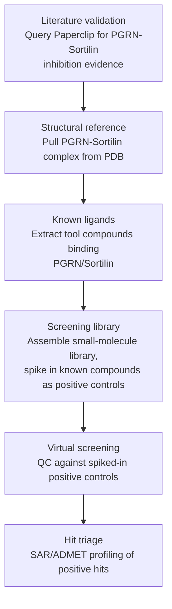
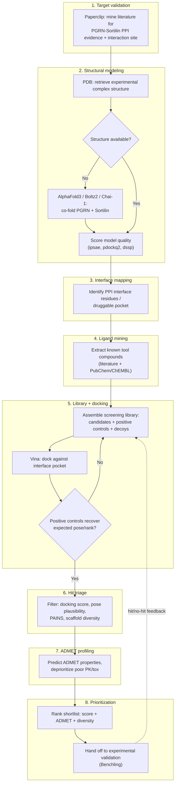

## Flow

- Given our therapeutic hypothesis, here are the following steps:
- Query paperclip for existing biomed literature to support the hypothesis: inhibiting PGRN/Sortin complex
- Query PDB database for complex structure
- Extract known tool compounds which binds to PGRN/sortin
- Search/compile small compound library for virtual screening, with above compounds spike-in as positive control to QC
  the virtual screening
- SRA or ADMET calculation for the positive hits

## Improved

- Literature validation: query Paperclip for biomedical literature supporting the hypothesis that inhibiting the PGRN–Sortilin complex is therapeutically relevant
- Structural reference: pull the PGRN–Sortilin complex structure from PDB
- Known ligands: extract literature-reported tool compounds that bind PGRN or Sortilin
- Screening library: assemble a small-molecule library for virtual screening, spiking in the known tool compounds as positive controls to QC the screen
- Hit triage: run SAR/ADMET profiling on the positive hits

## Diagram

## Computational biologist review

### Diagram

### Steps

- Target validation: Paperclip literature mining — confirm PGRN–Sortilin PPI hypothesis, extract reported interaction site/hotspot residues
- Structural modeling: pull PDB complex if available; else co-fold with AlphaFold3/Boltz2/Chai-1; score model quality (ipsae, pdockq2, dssp)
- Interface mapping: define the druggable pocket at the PPI interface (PPI interfaces are often flat — pocket ID matters more than for a classic active site)
- Ligand mining: pull known tool compounds/chemical probes (literature + PubChem/ChEMBL) as pharmacophore seeds and controls
- Library + docking: build screening library with positive controls (known binders) and decoys (for enrichment/ROC); dock with Vina against the interface pocket
- Docking validation gate: re-dock positive controls first — only proceed to full-library screen if they recover expected pose/rank
- Hit triage: filter by docking score, pose/interaction-fingerprint plausibility, PAINS, and scaffold diversity (avoid redundant chemotypes)
- ADMET profiling: predict PK/tox liabilities, deprioritize poor-ADMET hits
- Prioritization: rank shortlist (score + ADMET + diversity), hand off to experimental validation (tracked in Benchling)
- Feedback loop: feed experimental hit/no-hit data back into library/docking to refine scoring — not a one-shot screen
